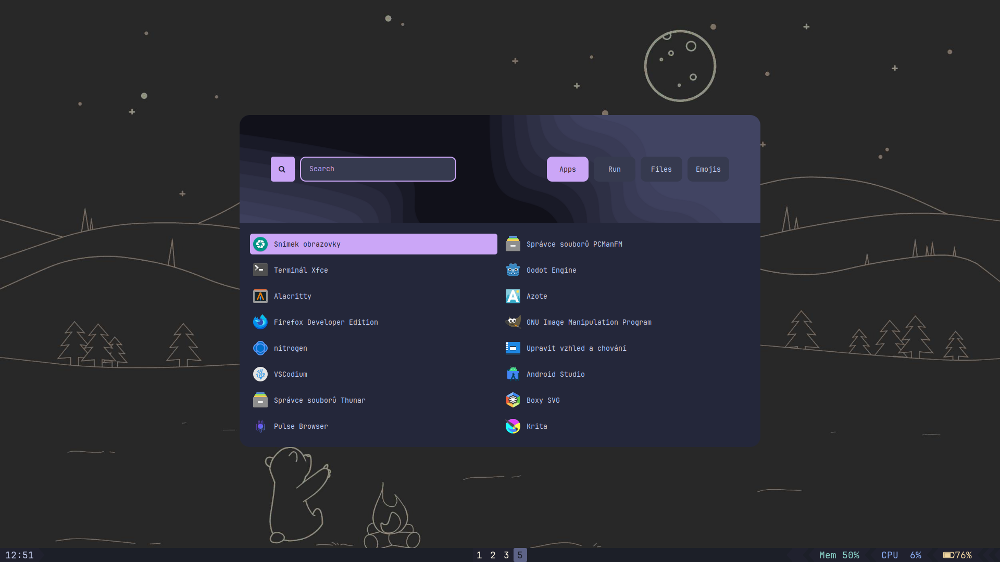

# My rofi
- inspired by [adi1090x config](https://github.com/adi1090x) (*type 7;style 2*) and [catppuccin color palette](https://github.com/catppuccin)

## usage
- *put this into some directory on PATH*
- `rofi -theme <config.rasi> -show drun`

## dependencies
- rofi
- rofi-emoji
- JetBrains mono nerd font

## optional dependencies
- unicode-emoji 
- noto-fonts-emoji

